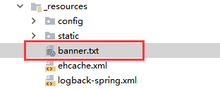

# SpringBoot学习笔记
记录一下SpringBoot源码阅读笔记，通过debug查看应用启动时spring的工作流程，记录一些常用的扩展功能与自带功能。
如Aware、事件发布机制，BeanDefinitionRegistryPostProcessor，ImportBeanDefinitionRegistrar，
BeanFactory，FactoryBean，BeanFactoryPostProcessor，BeanPostProcessor等。

## 版本
```xml
    <parent>
        <groupId>org.springframework.boot</groupId>
        <artifactId>spring-boot-starter-parent</artifactId>
        <version>2.0.3.RELEASE</version>
        <relativePath/>
    </parent>
```

## 源码阅读
SpringBoot应用启动入口为`SpringApplication.run(this.class,args)`:
```java
public static ConfigurableApplicationContext run(Class<?> primarySource,
			String... args) {
		return run(new Class<?>[] { primarySource }, args);
}
```
该方法先会调用内部最终的构造方法：
```java
public SpringApplication(ResourceLoader resourceLoader, Class<?>... primarySources) {
    ...
    //初始化ApplicationContextInitializer
    setInitializers((Collection) getSpringFactoriesInstances(
                ApplicationContextInitializer.class));
    //初始化ApplicationListener
    setListeners((Collection) getSpringFactoriesInstances(ApplicationListener.class));
    ...
}
```
在构造方法内，会初始化一些成员变量的值，和一些内置的`ApplicationContextInitializer`与
`ApplicationListener`，这些变量的优先级是最高的，可以对后续操作造成影响，如果需要应用加载
自己的`ApplicationContextInitializer`与`ApplicationListener`，可以在**资源根目录**创建
**META-INF\spring.factories**文件，spring内置了很多默认的成员变量，以下是默认的spring.factories
的部分内容：
```
...
# Application Context Initializers
org.springframework.context.ApplicationContextInitializer=\
org.springframework.boot.context.ConfigurationWarningsApplicationContextInitializer,\
org.springframework.boot.context.ContextIdApplicationContextInitializer,\
org.springframework.boot.context.config.DelegatingApplicationContextInitializer,\
org.springframework.boot.web.context.ServerPortInfoApplicationContextInitializer

# Application Listeners
org.springframework.context.ApplicationListener=\
org.springframework.boot.ClearCachesApplicationListener,\
org.springframework.boot.builder.ParentContextCloserApplicationListener,\
org.springframework.boot.context.FileEncodingApplicationListener,\
org.springframework.boot.context.config.AnsiOutputApplicationListener,\
org.springframework.boot.context.config.ConfigFileApplicationListener,\
org.springframework.boot.context.config.DelegatingApplicationListener,\
org.springframework.boot.context.logging.ClasspathLoggingApplicationListener,\
org.springframework.boot.context.logging.LoggingApplicationListener,\
org.springframework.boot.liquibase.LiquibaseServiceLocatorApplicationListener
...
```
在调用完构造函数后，调用该实例的`run()`方法：
```java
    public ConfigurableApplicationContext run(String... args) {
        StopWatch stopWatch = new StopWatch();
        stopWatch.start();
        ConfigurableApplicationContext context = null;
        Collection<SpringBootExceptionReporter> exceptionReporters = new ArrayList<>();
        configureHeadlessProperty();
        //实例化了SpringApplicationRunListeners对象，其持有EventPublishingRunListener实例
        SpringApplicationRunListeners listeners = getRunListeners(args);
        //发布应用启动的事件ApplicationStartingEvent，并由SimpleApplicationEventMulticaster进行多线路处理
        listeners.starting();
        try {
            //应用参数加载
            ApplicationArguments applicationArguments = new DefaultApplicationArguments(
                    args);
            //准备环境参数
            ConfigurableEnvironment environment = prepareEnvironment(listeners,
                    applicationArguments);
            configureIgnoreBeanInfo(environment);
            //居然是在这里打印应用的logo
            Banner printedBanner = printBanner(environment);
            //创建容器上下文对象，web应用为AnnotationConfigServletWebServerApplicationContext
            //经过多层继承，在父类的构造方法初始化了许多成员变量
            /*
            先执行顶层父类DefaultResourceLoader构造方法，初始化this.classLoader = ClassUtils.getDefaultClassLoader()
            执行父类AbstractApplicationContext构造方法，初始化this.resourcePatternResolver = getResourcePatternResolver()
            执行父类GenericApplicationContext构造方法，初始化this.beanFactory = new DefaultListableBeanFactory()
                beanFactory初始化时，经过多层继承初始化部分成员变量
            执行父类GenericWebApplicationContext构造方法
            执行父类ServletWebServerApplicationContext构造方法
            执行本身构造方法，初始化this.reader与this.scanner
                reader包含了各类注解解析器
            */
            context = createApplicationContext();
            exceptionReporters = getSpringFactoriesInstances(
                    SpringBootExceptionReporter.class,
                    new Class[]{ConfigurableApplicationContext.class}, context);
            //预处理上下文
            prepareContext(context, environment, listeners, applicationArguments,
                    printedBanner);
            //关键方法在此，内容非常多
            refreshContext(context);
            //这里居然没做什么
            afterRefresh(context, applicationArguments);
            stopWatch.stop();
            if (this.logStartupInfo) {
                new StartupInfoLogger(this.mainApplicationClass)
                        .logStarted(getApplicationLog(), stopWatch);
            }
            //发布ApplicationStartedEvent事件
            listeners.started(context);
            //调用ApplicationRunner与CommandLineRunner的实现类
            callRunners(context, applicationArguments);
        } catch (Throwable ex) {
            handleRunFailure(context, ex, exceptionReporters, listeners);
            throw new IllegalStateException(ex);
        }

        try {
            //发布ApplicationReadyEvent事件
            listeners.running(context);
        } catch (Throwable ex) {
            handleRunFailure(context, ex, exceptionReporters, null);
            throw new IllegalStateException(ex);
        }
        //返回spring上下文对象
        return context;
    }
```
---
## 事件发布
在上述`run()`方法中，使用了spring内置的事件发布机制：
```java
        //实例化了SpringApplicationRunListeners对象，其持有EventPublishingRunListener实例
        SpringApplicationRunListeners listeners = getRunListeners(args);
        //发布应用启动的事件ApplicationStartingEvent，并由SimpleApplicationEventMulticaster进行多线路处理
        listeners.starting();
```
在`getRunListeners(args)`方法获取spring内置的所有`SpringApplicationRunListener`，默认返回**EventPublishingRunListener**实例，
一般`spring.factories`中配置的**EventPublishingRunListener**已能满足我们的需求，如果需要扩充请自行添加:
```
# Run Listeners
org.springframework.boot.SpringApplicationRunListener=\
org.springframework.boot.context.event.EventPublishingRunListener
```
### 事件发布与事件的处理有以下方式：
* 定义一个事件类型MyEvent如上述的ApplicationStartingEvent：
```java
/**
 * 测试事件发布监听
 * @author yanjunhao
 * @date 2018年12月20日
 */
public class MyEvent extends ApplicationEvent {
    private String message;

    public String getMessage() {
        return message;
    }

    public void setMessage(String message) {
        this.message = message;
    }

    public MyEvent(Object source, String message) {
        super(source);
        this.message = message;
    }

    /**
     * Create a new ApplicationEvent.
     *
     * @param source the object on which the event initially occurred (never {@code null})
     */
    public MyEvent(Object source) {
        super(source);
    }
}
```
* 事件的发布需要通过接口**ApplicationEventPublisher**的实现类，spring的上下文对象**ApplicationContext**可以满足此要求：
```java
applicationContext.publishEvent(new MyEvent(this.class,"消息正文"));
```
* 现在我们要处理**MyEvent**事件，可以通过实现接口**ApplicationListener**或者使用注解`@EventListener`来实现：
```java
/**
 * 测试事件监听-监听MyEvent事件
 *
 * @author yanjunhao
 * @date 2018年12月20日
 */
@Component
public class MyEventListenerOne implements ApplicationListener<MyEvent> {
    @Override
    public void onApplicationEvent(@NotNull MyEvent event) {
        System.out.println("MyEventListenerOne我听到啦" + event.getMessage());
    }
}
```
```java
/**
 * 测试事件监听-监听MyEvent事件
 *
 * @author yanjunhao
 * @date 2018年12月20日
 */
@Component
public class MyEventListenerTwo {
    @EventListener(classes = {MyEvent.class})
    public void listener(Object eventObj) {
        MyEvent event = (MyEvent) eventObj;
        System.out.println("MyEventListenerTwo我听到啦" + event.getMessage());
    }
}
```
---
## ConfigurableEnvironment加载
在发布完`ApplicationStartingEvent`事件后，应用开始加载配置项：
```java
//准备环境参数
ConfigurableEnvironment environment = prepareEnvironment(listeners,applicationArguments);
```
在**prepareEnvironment**方法中，初始化`ConfigurableEnvironment`实例，并加载默认配置。
```java
//web应用返回StandardServletEnvironment，构造函数调用时，已加载系统参数
ConfigurableEnvironment environment = getOrCreateEnvironment();
configureEnvironment(environment, applicationArguments.getSourceArgs());
```
主要的代码实现在**configureEnvironment**中：
```java
    protected void configureEnvironment(ConfigurableEnvironment environment,
                                        String[] args) {
        configurePropertySources(environment, args);
        configureProfiles(environment, args);
    }
```
**configurePropertySources**方法初步加载`defaultProperties`，然后判断是否有命令行参数传入，如果
有，把命令行参数添加到环境变量中，且优先级最高:
```java
    protected void configurePropertySources(ConfigurableEnvironment environment,
                                            String[] args) {
        MutablePropertySources sources = environment.getPropertySources();
        if (this.defaultProperties != null && !this.defaultProperties.isEmpty()) {
            //如果有默认配置，添加到最后
            sources.addLast(
                    new MapPropertySource("defaultProperties", this.defaultProperties));
        }
        if (this.addCommandLineProperties && args.length > 0) {
            String name = CommandLinePropertySource.COMMAND_LINE_PROPERTY_SOURCE_NAME;
            if (sources.contains(name)) {
                PropertySource<?> source = sources.get(name);
                CompositePropertySource composite = new CompositePropertySource(name);
                composite.addPropertySource(new SimpleCommandLinePropertySource(
                        "springApplicationCommandLineArgs", args));
                composite.addPropertySource(source);
                sources.replace(name, composite);
            } else {
                //-Dxxxxx=yyyy这种参数的优先级最高
                sources.addFirst(new SimpleCommandLinePropertySource(args));
            }
        }
    }
```
在**configureProfiles**中获取`spring.profiles.active`并设置到环境变量中。完成这些操作后，发布
`ApplicationEnvironmentPreparedEvent`事件，一些配置中心的实现方式，都可以基于此事件的接收来做自己
的配置嵌入。其中内置的监听者中，比较重要的是**ConfigFileApplicationListener**，它监听到`ApplicationEnvironmentPreparedEvent`事件，
会获取所有**EnvironmentPostProcessor**接口实例，调用`postProcessEnvironment()`方法。
```java
//准备好环境变量，发布ApplicationEnvironmentPreparedEvent事件
/*
 ConfigFileApplicationListener
    ConfigFileApplicationListener实现了接口SmartApplicationListener,EnvironmentPostProcessor，并在实现方法中获取所有实现EnvironmentPostProcessor接口
    的实例(包括自己)，并进行调用postProcessEnvironment()
    必须要注册在META-INF/spring.factories中
 */
listeners.environmentPrepared(environment);
```
---
## 打印自定义LOGO
现在回到`run()`方法，在初始化**ConfigurableEnvironment**后，应用就开始打印`LOGO`：
```java
//居然是在这里打印应用的logo
Banner printedBanner = printBanner(environment);
```
spring内置了好几个打印用的`Banner`实例，用于对应不同格式的LOGO。你可以用`文本`，`图片`，`GIF`作
为自己应用的LOGO，图片跟GIF的效果不怎么好（亲测）。现在讲讲如何定义我们的LOGO，以文本为例。
* 创建banner.txt（其它格式命名也要为`banner`）
* 把banner.txt放置到资源目录中


* 如果是文本的LOGO，可以使用`{配置}`来打印配置信息，如spring-boot版本为`${spring-boot.version}`，
详细可以查看官方关于**Banner**的说明。
* 编译重启即可看到自定义的LOGO生效。
---
## spring上下文对象构造
在完成前面的工作后，应用开始构造上下文对象**ConfigurableApplicationContext**，其中还包括了**Bean**的
创建，注入等复杂操作。首先是通过反射先调用构造方法，创建上下文对象：
```java
    context = createApplicationContext();
    ...
    protected ConfigurableApplicationContext createApplicationContext() {
        Class<?> contextClass = this.applicationContextClass;
        if (contextClass == null) {
            try {
                switch (this.webApplicationType) {
                    case SERVLET:
                        contextClass = Class.forName(DEFAULT_WEB_CONTEXT_CLASS);
                        break;
                    case REACTIVE:
                        contextClass = Class.forName(DEFAULT_REACTIVE_WEB_CONTEXT_CLASS);
                        break;
                    default:
                        contextClass = Class.forName(DEFAULT_CONTEXT_CLASS);
                }
            } catch (ClassNotFoundException ex) {
                throw new IllegalStateException(
                        "Unable create a default ApplicationContext, "
                                + "please specify an ApplicationContextClass",
                        ex);
            }
        }
        return (ConfigurableApplicationContext) BeanUtils.instantiateClass(contextClass);
    }
```
上述创建容器上下文对象，web应用为**AnnotationConfigServletWebServerApplicationContext**，
经过多层继承，在父类的构造方法初始化了许多成员变量：

* 先执行顶层父类DefaultResourceLoader构造方法，初始化this.classLoader = ClassUtils.getDefaultClassLoader()
* 执行父类AbstractApplicationContext构造方法，初始化this.resourcePatternResolver = getResourcePatternResolver()
* 执行父类GenericApplicationContext构造方法，初始化this.beanFactory = new DefaultListableBeanFactory()
    * beanFactory初始化时，经过多层继承初始化部分成员变量
* 执行父类GenericWebApplicationContext构造方法
* 执行父类ServletWebServerApplicationContext构造方法
* 执行本身构造方法，初始化this.reader与this.scanner
    * reader包含了各类注解解析器

在调用完构造方法后，执行`prepareContext`方法。在此方法内，会给上下文对象设置**ConfigurableEnvironment**对象，
并执行之前已加载的**ApplicationContextInitializer**，最后发布**ApplicationPreparedEvent**事件：
```java
    private void prepareContext(ConfigurableApplicationContext context,
                                ConfigurableEnvironment environment, SpringApplicationRunListeners listeners,
                                ApplicationArguments applicationArguments, Banner printedBanner) {
        //设置Environment
        context.setEnvironment(environment);
        postProcessApplicationContext(context);
        //在上下文Refresh前调用所有已加载ApplicationContextInitializer
        applyInitializers(context);
        //发布contextPrepared事件，不过目前此版本好像没有响应此事件
        listeners.contextPrepared(context);
        if (this.logStartupInfo) {
            logStartupInfo(context.getParent() == null);
            logStartupProfileInfo(context);
        }

        // Add boot specific singleton beans
        // 注册了一个单例bean，这种注册方式不会触发创建回调函数与销毁回调函数
        context.getBeanFactory().registerSingleton("springApplicationArguments",
                applicationArguments);
        if (printedBanner != null) {
            context.getBeanFactory().registerSingleton("springBootBanner", printedBanner);
        }

        // Load the sources
        Set<Object> sources = getAllSources();
        Assert.notEmpty(sources, "Sources must not be empty");
        load(context, sources.toArray(new Object[0]));
        //发布ApplicationPreparedEvent事件，
        listeners.contextLoaded(context);
    }
```

然后会调用`refreshContext`方法。此方法比较关键，内容非常多，**Bean**的配置扫描分析、加载、实例化与注入也是在此方法内完成，这里
先跳过。

等**Bean**创建完毕调用`afterRefresh`方法，当前版本里面没有做什么操作。最后就是发布**ApplicationStartedEvent**
事件，并调用**ApplicationRunner**与**CommandLineRunner**的实现类。
```java
    //关键方法在此，内容非常多
    refreshContext(context);
    //这里居然没做什么
    afterRefresh(context, applicationArguments);
    ...
    //发布ApplicationStartedEvent事件
    listeners.started(context);
    //调用ApplicationRunner与CommandLineRunner的实现类
    callRunners(context, applicationArguments);
```

上述操作都没有出现异常，说明启明成功，发布**ApplicationReadyEvent**事件，并返回上下文对象。
```java
    try {
        //发布ApplicationReadyEvent事件
        listeners.running(context);
    } catch (Throwable ex) {
        handleRunFailure(context, ex, exceptionReporters, null);
        throw new IllegalStateException(ex);
    }
    //返回spring上下文对象
    return context;
```
---
## Bean实例化过程
上述的`refreshContext`方法，最终会调用到父类的**AbstractApplicationContext**的`refresh`方法。
```java
    @Override
    public void refresh() throws BeansException, IllegalStateException {
        synchronized (this.startupShutdownMonitor) {
            // Prepare this context for refreshing.
            // 初始化PropertySources
            prepareRefresh();

            // Tell the subclass to refresh the internal bean factory.
            //刷新子类BeanFactory，并返回当前BeanFactory
            ConfigurableListableBeanFactory beanFactory = obtainFreshBeanFactory();

            // Prepare the bean factory for use in this context.
            // 配置beanFactory上下文的标准特征，例如ClassLoader与 post-processors（后置处理器
            prepareBeanFactory(beanFactory);

            try {
                // Allows post-processing of the bean factory in context subclasses.
                //子类添加其post-processing
                postProcessBeanFactory(beanFactory);

                // Invoke factory processors registered as beans in the context.
                // 执行spring内置的BeanFactoryPostProcessor，如ConfigurationClassPostProcessor（引导@Configuration配置）
                /*
                  先执行实现了PriorityOrdered接口的BeanDefinitionRegistryPostProcessors接口方法如ConfigurationClassPostProcessor
                       在ConfigurationClassPostProcessor.processConfigBeanDefinitions()中
                       先处理ImportBeanDefinitionRegistrar实例（如果实例实现了XXXAware接口，
                       先执行XXXAware接口方法，再调用ImportBeanDefinitionRegistrar接口方法）
                 */
                /*
                  再执行实现了Ordered接口的BeanDefinitionRegistryPostProcessor实例方法，如果实例实现了XXXAware接口，先执行XXXAware接口方法,
                  然后在invokeBeanDefinitionRegistryPostProcessors()调用BeanDefinitionRegistryPostProcessor接口方法
                 */
                /*
                  最后执行其它BeanDefinitionRegistryPostProcessor实例方法，如果实例实现了XXXAware接口，先执行XXXAware接口方法
                 */
                /*
                  上述所有BeanDefinitionRegistryPostProcessor实例方法执行完毕后，执行BeanDefinitionRegistryPostProcessor父接口
                  BeanFactoryPostProcessor接口方法（算是回调方法吧）
                 */
                /*
                  然后获取实现BeanFactoryPostProcessor的实例数组进行遍历，如果此实例已在上面的步骤中执行过，则跳过
                  如果没执行，则按实现PriorityOrdered接口的先执行，再执行实现Ordered接口的，最后执行剩下的。
                  执行完毕清除beanFactory中的MetadataCache
                 */
                invokeBeanFactoryPostProcessors(beanFactory);

                // Register bean processors that intercept bean creation.
                /*
                  按顺序(PriorityOrdered>Ordered>其它)注册BeanPostProcessor，把BeanPostProcessor设置到BeanFactory中
                 */
                registerBeanPostProcessors(beanFactory);

                // Initialize message source for this context.
                initMessageSource();

                // Initialize event multicaster for this context.
                initApplicationEventMulticaster();

                // Initialize other special beans in specific context subclasses.
                /*
                  执行子类的onRefresh()方法，根据不同的情况，初始化不同的特殊bean
                  web应用执行GenericWebApplicationContext.onRefresh()
                  再执行ServletWebServerApplicationContext.onRefresh()
                        在createWebServer()中创建Web相关的Bean如DispatcherServlet等。
                 */
                onRefresh();

                // Check for listener beans and register them.
                /*
                  检查并注册ApplicationListener实现类，并把earlyApplicationEvents发布
                 */
                registerListeners();

                // Instantiate all remaining (non-lazy-init) singletons.
                /*
                  实例化所有非懒加载的单例，创建Bean时会调用各个BeanPostProcessor的前后置方法。
                  @PostConstruct, @Resource, @PreDestroy也是通过BeanPostProcessor完成（CommonAnnotationBeanPostProcessor）
                  You can see in the following diagram from Spring that these BPP's are handled after Dependency Injection but before Bean Ready For Use (Which means as much as injectable).
                 */
                finishBeanFactoryInitialization(beanFactory);

                // Last step: publish corresponding event.
                /*
                清空资源缓存
                初始化LifecycleProcessor，一般是默认的DefaultLifecycleProcessor
                    LifecycleProcessor获取所有实现Lifecycle接口的Bean，调用其start()方法
                发布ContextRefreshedEvent事件
                 */
                finishRefresh();
            } catch (BeansException ex) {
                if (logger.isWarnEnabled()) {
                    logger.warn("Exception encountered during context initialization - " +
                            "cancelling refresh attempt: " + ex);
                }

                // Destroy already created singletons to avoid dangling resources.
                /*
                如果捕获到异常，则调用单例Bean生命周期中的Destroy方法
                 */
                destroyBeans();

                // Reset 'active' flag.
                cancelRefresh(ex);

                // Propagate exception to caller.
                throw ex;
            } finally {
                // Reset common introspection caches in Spring's core, since we
                // might not ever need metadata for singleton beans anymore...
                resetCommonCaches();
            }
        }
    }
```

先说说`prepareRefresh()`方法，其方法注释为：

    Prepare this context for refreshing, setting its startup date and active flag as well as performing any initialization of property sources.

在这个方法内，会初始化`PropertySource`并进行校验：
```java
    // Initialize any placeholder property sources in the context environment
    initPropertySources();

    // Validate that all properties marked as required are resolvable
    // see ConfigurablePropertyResolver#setRequiredProperties
    getEnvironment().validateRequiredProperties();
```

